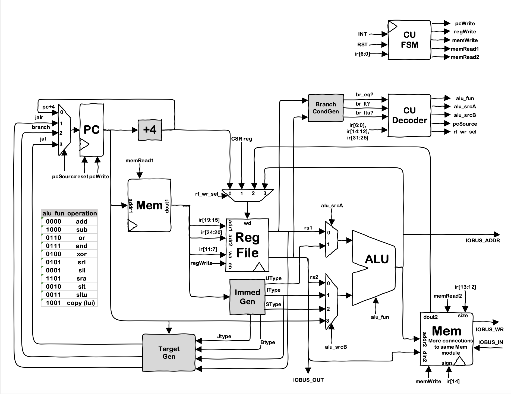
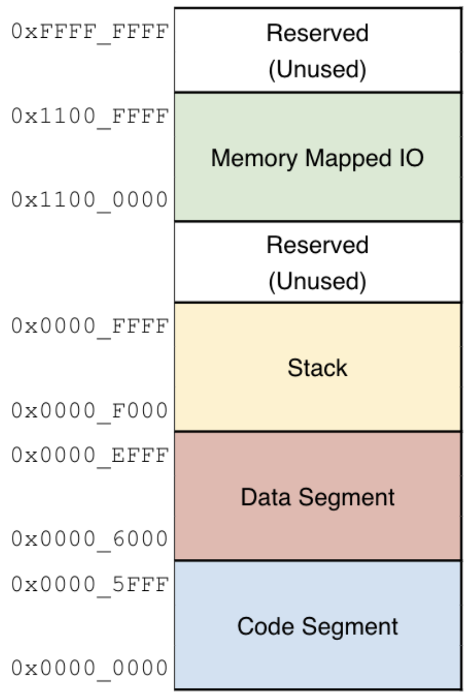

# RISC-V 32-bit Multicycle MCU

## Author 

By Jack Krammer on March 16, 2025 for Cal Poly CPE 233

## Introduction

A multicycle MCU capable of running assembly programs based on the 32-bit RISC-V ISA. This project utilizes SystemVerilog and RISC-V assembly code and was developed in Vivado for a Basys 3 Artix-7 FPGA board. The MCU also provides functionality to interact with board inputs and outputs via memory mapped IO.

## Description

### MCU Architecture Diagram

**Figure 1.** MCU architecture with modules and connections.

### Memory Map

**Figure 2.** Memory address range the MCU was designed to utilize.

### Module Hierarchy

- OTTER_wrapper.sv
    - clock_divider.sv
    - OTTER_mcu.sv
        - OTTER_pc.sv
        - OTTER_mem_byte.sv
            - multicycle_test_all.mem
        - OTTER_register_file.sv
        - OTTER_cu_fsm.sv
        - OTTER_cu_decoder.sv
        - OTTER_alu.sv
        - OTTER_value_gen.sv
        - mux421.sv
        - mux221.sv
    - seven_segment_display.sv
        - hex2bcd.sv
        - cathode_driver.sv
    - debounce_button.sv
- basys3constraints.xdc

### Module Descriptions

OTTER_wrapper.sv
- Top level wrapper module for the MCU to help interface with IO via MMIO. 

clock_divider.sv
- Divides the input clock to output a slow clock. The MAX_COUNT parameter enables this module to output a variable frequency clock.

OTTER_mcu.sv
- Assembles modules into a cohesive unit that can process RISC-V 32-bit assembly instructions.

OTTER_pc.sv
- Program counter module for the OTTER.

OTTER_mem_byte.sv
multicycle_test_all.mem
OTTER_register_file.sv
OTTER_cu_fsm.sv
OTTER_cu_decoder.sv
OTTER_alu.sv
OTTER_value_gen.sv
mux421.sv
mux221.sv
seven_segment_display.sv
hex2bcd.sv
cathode_driver.sv
debounce_button.sv
basys3constraints.xdc

## Acknowledegments

This project was created with the guidance and help of Professor Joseph Callenes at Cal Poly for CPE 233 (Computer Design and Assembly Language Programming).

